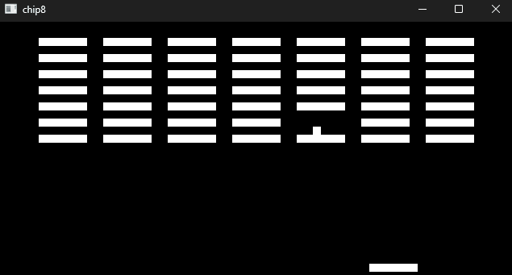
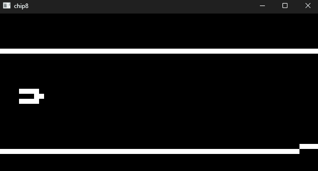
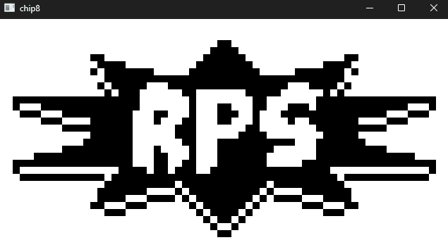

# chip8 emulator
A rudimentary chip8 emulator (not super-chip or xo-chip).
Requires SDL3.dll to be in same folder as .exe in order to run

```
chip8-emulator.exe <rom path>
```

Keymapping to chip8's 16 keys is the modern standard:
```
Keyboard:       CHIP-8:
1 2 3 4    →    1 2 3 C
Q W E R    →    4 5 6 D
A S D F    →    7 8 9 E
Z X C V    →    A 0 B F
```

*br8kout.ch8*


*flightrunner.ch8*


*rps.ch8*


## Testing
- IBM ROM - https://github.com/loktar00/chip8/blob/master/roms/IBM%20Logo.ch8
- corax89's chip8-test-rom - https://github.com/corax89/chip8-test-rom/tree/master
- https://github.com/Timendus/chip8-test-suite

## Resources
- Cowgod's Chip-8 technical reference - http://devernay.free.fr/hacks/chip8/C8TECH10.HTM
- Tvil's Guide to making a CHIP-8 emulator - https://tobiasvl.github.io/blog/write-a-chip-8-emulator/
- chip8Archive for games - https://johnearnest.github.io/chip8Archive/
- Claude - for bouncing ideas off and help with tricky instructions